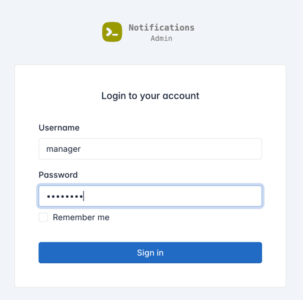
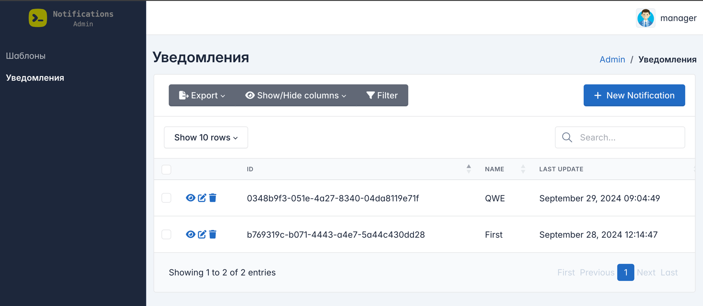

# Admin panel

### Окружение

    make init
    source .venv/bin/activate

### Миграции

Автогенерация миграций

    alembic revision --autogenerate -m "Added new table"

Создать новую миграцию вручную

    alembic revision -m "create kek table"

Применить миграцию 

    alembic upgrade head

### Запуск

В `.env` указать энвы

    <в корне>
    docker compose up -d

### Админ панель

Перейти на http://localhost/admin

Пользователи
- manager - может все, создавать, удалять, редактировать и тд
- viewer - может только просматривать

Пароль: password

